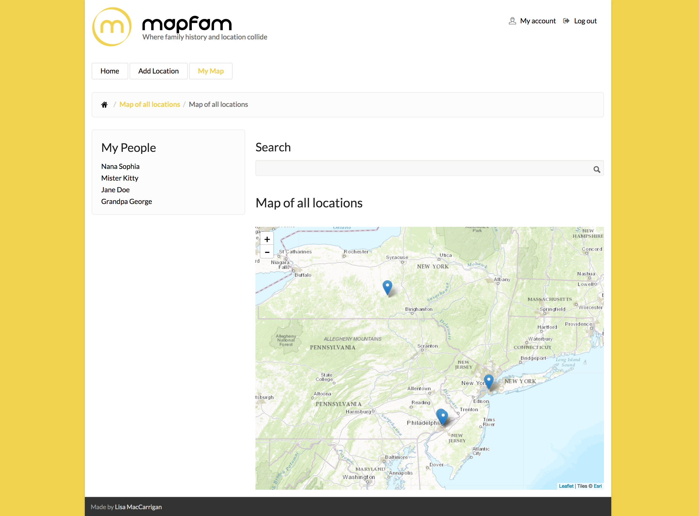

# **MapFam**

#### Epicodus Capstone 12.22.2016

#### By [Lisa MacCarrigan](https://github.com/lisamaccarrigan)

### **Description**

MapFam is a proof of concept (and work in progress) web application that provides users with a way to archive special locations for later reference. Locations include burial sites, properties (i.e. houses and business locations), and other places deemed important to family members and close friends. This application utilizes Drupal 7.x, contributed modules, and custom modules.

----
### **Screenshots**
[Login Screen](sites/all/themes/insha/img/login.png)
[Map View](sites/all/themes/insha/img/map.png)
[Location Close Up](sites/all/themes/insha/img/burialsite.png)
[Add Location Snippet](sites/all/themes/insha/img/addlocationsnippet.png)

----
### **Setup/Installation Requirements**

If editing:
* Clone this repository: https://github.com/LisaMacCarrigan/MapFam_CapstoneProject.git
* OPEN project folder ('MapFam_CapstoneProject') in Code Editor of choice

----

### **Known Bugs**

No known bugs.

----
### **Support and contact details**

For comments or questions, please email Lisa.MacCarrigan@gmail.com

----
### **Technologies Used**

* PHP
* HTML
* CSS
* Drupal 7.x

----
### **License**

*This application is licensed under the MIT license*

----
**Copyright (c) 2016 [Lisa MacCarrigan](https://github.com/lisamaccarrigan)**
